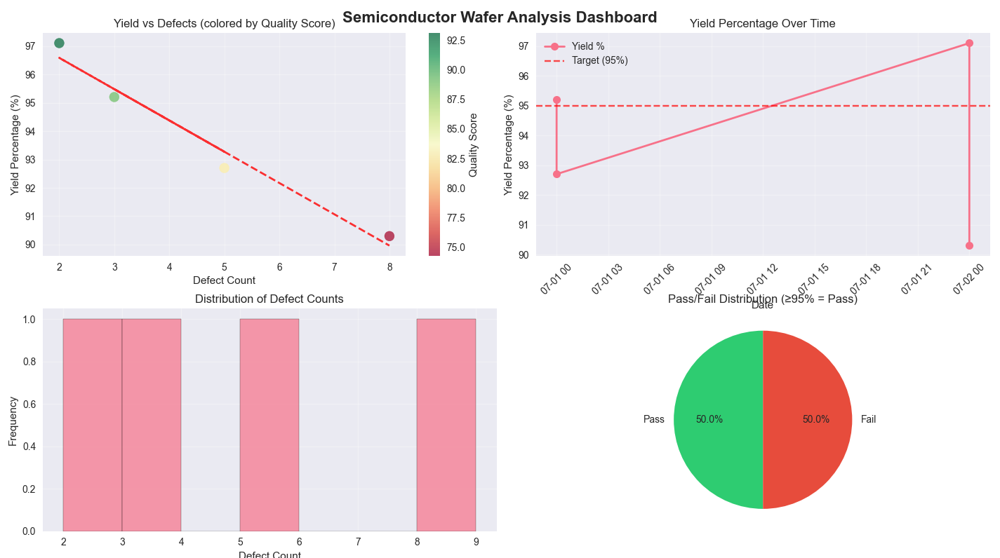
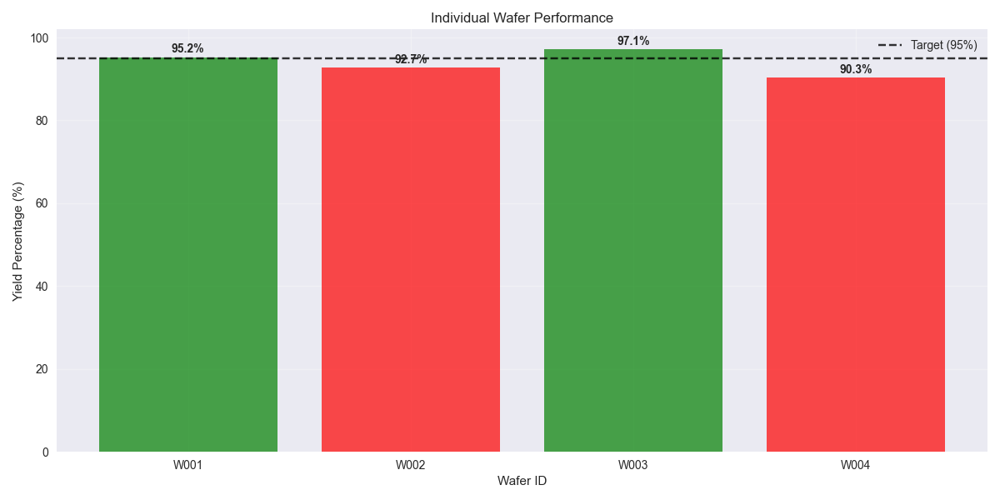

# Semiconductor Production Data Analysis

## Overview

This project provides a **comprehensive, professional-grade workflow** for analyzing and visualizing semiconductor wafer production data. The project has been significantly enhanced with advanced analytics, object-oriented design, and comprehensive reporting capabilities.

This project is inspired by my academic experience and is closely related to the type of data analysis I worked on during my time at **IHP – Leibniz Institute for High Performance Microelectronics** in Frankfurt (Oder). IHP is a leading research center in silicon/germanium electronics and advanced semiconductor technologies.

## Project Structure

```
/
├── wafer_data.csv
├── main.py
├── requirements.txt
├── images/
│   ├── Individual-Wafer-Performance.png
│   └── Semiconductor-Wafer-Analysis-Dashboard.png
└── README.md
```

- **wafer_data.csv**: Example dataset of wafer production (date, wafer ID, yield percentage, defect count)
- **main.py**: Enhanced Python script with comprehensive analysis and visualization capabilities
- **requirements.txt**: Python dependencies for the project
- **images/**: Folder containing generated plots and analysis dashboards
- **README.md**: This documentation

## What This Project Does

### Core Features
- **Object-Oriented Design**: Organized code using a `WaferAnalyzer` class for better maintainability
- **Comprehensive Data Processing**: Automatic datetime handling, data validation, and derived metrics calculation
- **Advanced Analytics**: Statistical analysis, correlation studies, and quality scoring
- **Professional Visualizations**: Multi-panel dashboards and detailed performance charts
- **Automated Reporting**: Generates detailed reports with recommendations and KPIs
- **Quality Classification**: Automatic pass/fail classification based on yield thresholds

### Analysis Capabilities
- Loads and explores wafer production data from CSV files
- Calculates comprehensive statistics (mean, median, standard deviation, correlations)
- Performs quality scoring and pass/fail analysis
- Identifies top and bottom performing wafers
- Generates automated recommendations based on data patterns
- Creates professional-grade visualizations and reports

## Getting Started

### Prerequisites
- Python 3.7+
- Required libraries (install via requirements.txt):
  - pandas (≥1.3.0)
  - matplotlib (≥3.4.0)
  - seaborn (≥0.11.0)
  - numpy (≥1.21.0)

Install dependencies with:
```bash
pip install -r requirements.txt
```

### Running the Analysis

1. Place your data file (`wafer_data.csv`) in the project root directory
2. Run the analysis script:
   ```bash
   python main.py
   ```
3. The script will:
   - Load and validate the data
   - Display comprehensive statistics in the terminal
   - Generate and display interactive visualizations
   - Create detailed performance reports
   - Save plots in the images/ folder

## Results & Visualizations

### Semiconductor Wafer Analysis Dashboard


This comprehensive dashboard provides a complete overview of wafer production performance through four key visualizations:

1. **Yield vs Defects Scatter Plot** (Top Left): Shows the relationship between defect count and yield percentage, with color-coding based on quality score and a trend line to identify correlations
2. **Yield Over Time** (Top Right): Time series analysis showing yield percentage trends over the production period, with a target line at 95% for quick performance assessment
3. **Defect Count Distribution** (Bottom Left): Histogram showing the frequency distribution of defect counts across all wafers, helping identify common defect ranges
4. **Pass/Fail Analysis** (Bottom Right): Pie chart displaying the percentage of wafers meeting quality standards (≥95% yield), providing immediate insight into overall production quality

### Individual Wafer Performance


This detailed bar chart shows the yield percentage for each individual wafer with the following features:
- **Color-coded bars**: Green bars indicate wafers meeting the 95% yield target (Pass), while red bars show underperforming wafers (Fail)
- **Target line**: Horizontal dashed line at 95% yield for quick visual reference
- **Value labels**: Each bar displays the exact yield percentage for precise analysis
- **Performance ranking**: Wafers are displayed to easily identify top and bottom performers

This visualization is particularly useful for:
- Quality control teams to quickly identify problematic wafers
- Production managers to assess overall batch performance
- Engineers to investigate specific wafer issues
- Reporting to stakeholders with clear visual indicators

## Technical Features

### Advanced Analytics
- **Statistical Analysis**: Comprehensive descriptive statistics and correlation analysis
- **Quality Scoring**: Custom quality score combining yield percentage and defect count
- **Performance Classification**: Automatic pass/fail classification based on industry standards
- **Trend Analysis**: Time series analysis for production monitoring

### Professional Reporting
- **Automated KPI Calculation**: Key performance indicators with threshold-based alerts
- **Recommendation Engine**: Automated suggestions based on data patterns
- **Comprehensive Summaries**: Detailed analysis reports with actionable insights
- **Export-Ready Visualizations**: High-quality plots suitable for presentations and reports

### Code Quality
- **Object-Oriented Design**: Clean, maintainable code structure
- **Error Handling**: Robust error handling for file operations and data validation
- **Documentation**: Comprehensive docstrings and comments
- **Modular Architecture**: Easily extensible for additional analysis types

## Customization

The enhanced codebase supports extensive customization:
- **Custom Metrics**: Add new derived metrics and quality indicators
- **Advanced Visualizations**: Integrate additional plot types and interactive features
- **Data Sources**: Easily adapt for different data formats and sources
- **Reporting Templates**: Customize report formats and KPI thresholds
- **Integration**: Extend for integration with manufacturing execution systems

## Performance Insights

The analysis provides actionable insights for semiconductor manufacturing:
- **Yield Optimization**: Identify patterns affecting wafer yield
- **Quality Control**: Monitor defect trends and production consistency
- **Process Improvement**: Data-driven recommendations for production enhancement
- **Predictive Analytics**: Foundation for implementing predictive quality models

## Future Enhancements

Potential areas for further development:
- Machine learning models for yield prediction
- Real-time data integration and monitoring
- Advanced statistical process control (SPC) charts
- Integration with manufacturing execution systems (MES)
- Web-based dashboard for real-time monitoring

## Credits & Acknowledgements

Created by **Zeyad Mustafa**

*Enhanced with professional grade analytics and visualization capabilities for semiconductor manufacturing quality control.* 


