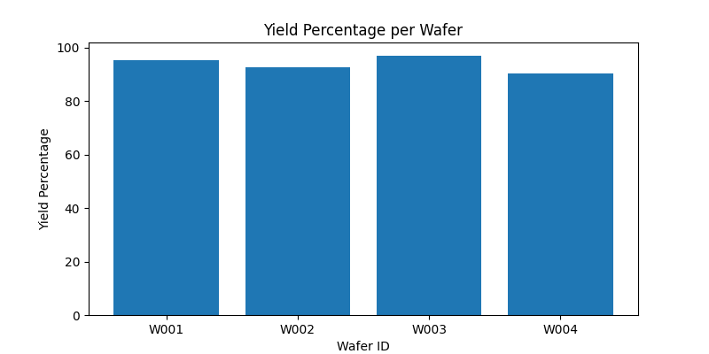
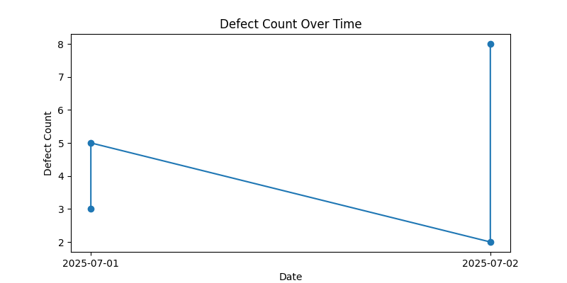

# Semiconductor Production Data Analysis

## Overview

This project provides a simple, beginner-friendly workflow for **analyzing and visualizing semiconductor wafer production data** This project is inspired by my academic experience and is closely related to the type of data analysis I worked on during my time at **IHP – Leibniz Institute for High Performance Microelectronics** in Frankfurt (Oder). IHP is a leading research center in silicon/germanium electronics and advanced semiconductor technologies.

## Project Structure

/    
├── wafer_data.csv    
├── analysis.py    
├── images/    
│ ├── Defect-Count-Over-Time.png    
│ └──Yield-Percentage-per-wafer.png    
└── README.md    

- **wafer_data.csv**: Example dataset of wafer production (date, wafer ID, yield percentage, defect count)
- **analysis.py**: Python script for data analysis and visualization
- **images/**: Folder containing generated plots
- **README.md**: This documentation

## What This Project Does

- Loads and explores wafer production data from a CSV file
- Calculates basic statistics (average yield, maximum defect count, etc.)
- Visualizes yield percentage per wafer and defect count over time
- Saves plots as image files for reporting and presentation

## Getting Started

### Prerequisites

- Python 3.x
- Required libraries:
  - `pandas`
  - `matplotlib`

Install dependencies with:

(pip install pandas matplotlib)

### Running the Analysis

1. Place your data file (`wafer_data.csv`) in the project root directory.
2. Run the analysis script: main.py

3. The script will:
- Print basic statistics to the terminal
- Generate and save two plots in the `images/` folder

## Results

### Yield Percentage per Wafer

This bar chart shows the yield percentage for each wafer, helping to identify units with lower performance.

### Defect Count Over Time

This line plot displays how the defect count changes over time, making it easier to spot trends or anomalies in the production process.

## How It Works

- The script reads the CSV file using `pandas`
- It calculates statistics such as average yield and maximum defect count
- `matplotlib` is used to create and save the plots
- All outputs are saved in the `images/` directory for easy access

## Customization

- You can modify the script to analyze different columns or add new types of visualizations
- For larger datasets or more advanced analysis, consider integrating additional Python libraries such as `numpy` or `plotly`

## Credits & Acknowledgements

Created by Zeyad Mustafa   

